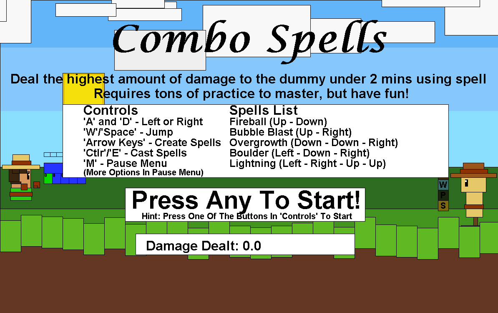
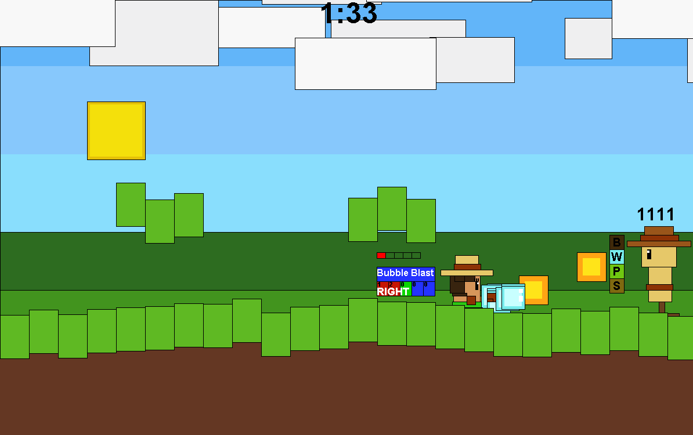
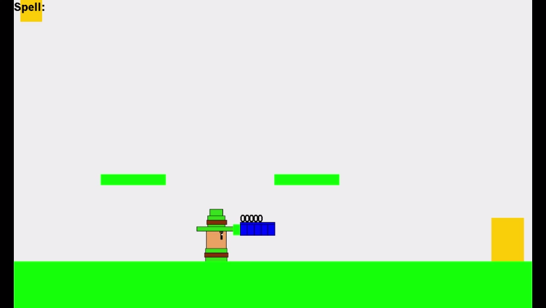
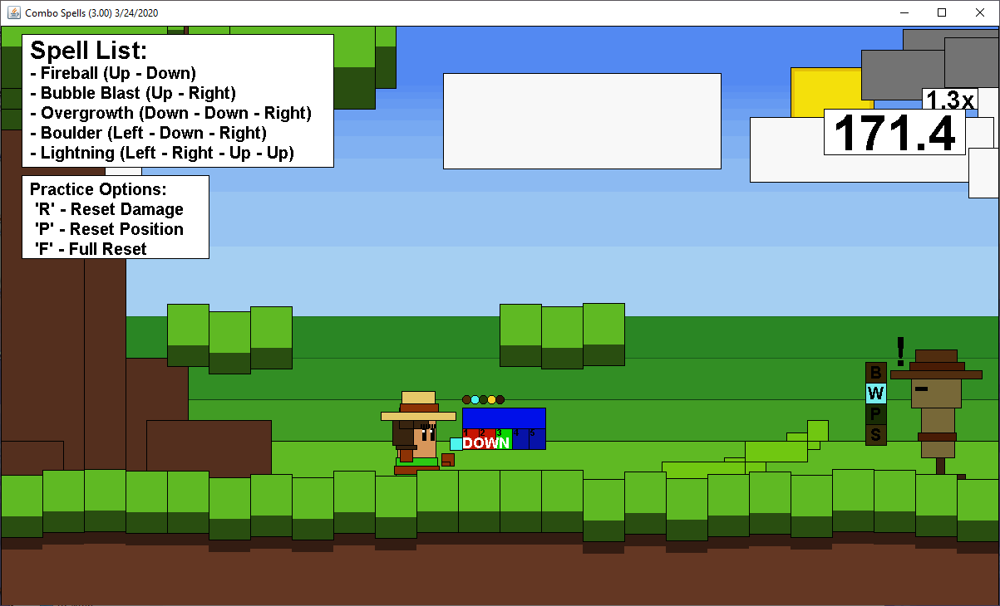

import { YouTube } from "astro-embed";

# Originally a School Project

Play as a magician and use different combinations of keys to create and synergize with the spells's elements to get the highest score damage on the dummy!

During high school was the first time I learned how to program, and Java was my first. I've been interested in game development, but I didn't know how.

Combo Spells was my final assignment and originally looked like this.



But I slowly refined it because of how fun the concept was.

This is what I've added:

- 2 Modes: Score Attack and Training Mode
- Menu GUI
- Updated graphics
- In-game Tutorial Manual

<YouTube id="https://youtu.be/ANaru-Nq96k?si=TJJLcjMwRckAe3YP" />

# How it was created?

This was a final school assignment. It's created in Java with the JFrame package (provided by my high school teacher). It was this course where I found that I enjoyed programming and was thrilled to do it.

It took me 3 weeks to finish and submit for the assignment, and came up with this.



For this one, I decided that I wanted to create a fighting game! But I didn't know how to implement physics or even know what a class was. So I lowered the scope and made it a Score Attack where you just hit the dummy repeatedly.

The games I've used for inspiration were _Tekken_ for its complex key input, and _King of the Hat_ to keep it simplistic with deep mechanical depth.

There's a saying that "Limitations breed Creativity", and a lot of the decision-making relies on my low skill level.

For the past 3 weeks of working on this in school, and with additional updates afterward, this is what I wanted...

## A Game that is Simple with Mechanical Depth

I wanted to have motion inputs and reward the player with powerful spells if they did a complex input. However, I didn't know how to make one (and I'm awful at motion inputs).

INSERT ORIGINAL CONCEPT

So I let the player do it at their own pace, they can select a directional key, and then cast the spell whenever they want to.

You could:

- Cast numerous fireballs
- Blast tons of bubbles
- Spike enemies with vines
- Cast a lightning strike
- Or even chuck a giant bolder

This allows for a variety of spells with only 4 arrow keys and a cast button. Allowing for simple casting and rewarded players if they're able to do it in quick succession. Simple with a high-skill ceiling.

Although I wished the controls weren't so...

Unintuitive.

INSERT KEYBIND

## A Game that is Deep in Strategy

After completing the game and submitting it, I realized how boring it was. So I decided to add status effects, synergizes, and damage multiplier to the game.

### Status Effects and Synergizes

This added additional depth to the game by having each spell interact with each other. Creating a puzzle element that the player can solve in order to get the largest damage possible to the poor dummy.

For example, the Lightning spell inflicts the Stun status effect.

- Increasing Fireball and Water Blast damage!

And for the Water Blast spell, inflicts the Wet status effect.

- Increasing Lightning damage, but decreasing Fireball damage.
- Will remove the Burn status effect inflicted by the Fireball spell.

There are positives and negatives to each interaction.

### Damage Multiplier

And the whole synergy system works with the Damage Multiplier system as well. Each spell has its own additive multiplier which will add up the multiplier while multiplying the damage inflicted. And it'll fade away if the player stops hitting the dummy.

This encourages faster gameplay and ways to prolong and increase the multiplier.

### Synergy and Status Effects

Both of these systems work in hand to encourage strategic thinking and faster gameplay. This encourages the player to really explore each of the spells' strengths and weaknesses, and make this more of a puzzle for the highest possible damage.

# The Making of the Game

## Graphics

The entire game's sprites, GUI, and animations are hard-coded with the JFrame. Each character, projectile, menu element, and environment are made by hand.

It started off from this.



To this...


And after months of working on it, it became something like this.



- Added a tree
- Implemented random generative grass
- Created moving clouds
- Hard-coded more animation sprites
- Then a added a few shadows in some areas

And in addition to the GUI, all of this is done by trial and error.

The whole thing was needlessly complicated.

## Struggles

And the hard-coded nature of the project persisted in my lack of knowledge of how Classes and Objects work. The majority of the data and variables are like this.

```java
int bubbleAmount = 25;
int bubbleSpreadRan = 10;
int bubbleSpreadBase = 5;
int bubbleSpeedRan = 35;
int bubbleSpeedBase = 20;
boolean[] bubbleSpawn = new boolean[this.bubbleAmount];
int[] bubbleX = new int[this.bubbleAmount];
int[] bubbleY = new int[this.bubbleAmount];
int bubbleW = 0;
int bubbleH = 0;
int[] bubbleSpawnpoint = new int[2];
double[] bubbleSpeed = new double[this.bubbleAmount];
int[] bubbleGravity = new int[this.bubbleAmount];
int[] bubbleGravityRand = new int[this.bubbleAmount];
int[] bubbleSpeedMaxRand = new int[this.bubbleAmount];
```

And imagine like this with the other spells, grass generation, and so forth.

Due to the unnecessary complications, I made a debugger menu on the side if you press "I" and extend the window to the left. You can see each individual variable and even the arrays for each object's property.

INSERT DEBUG MENU

If I were to remake this, I would utilize objects and ArrayLists, but the great part about this is that it's highly performant! There isn't garbage allocation happening since the objects are created at compile-time. It has a similar effect to a server system found with heavy amounts of objects.

It's simply hidden away off-screen when unused and gets reassigned when it is needed.

So while a mess, what matters more is that I managed to create something that is fun and was able to finish it.

# Conclusion

Starting from a 3-week high school project, I ended up working on it for a month or two and I was able to create something that I'm still proud of to this day!

And looking back, I can definitely see how much I've learned and developed my skills as a programmer. It's refreshing to see that I was incredibly passionate, and regardless of my poor practices, I was able to make something really great.

I'm planning to remake this project with a better framework (or engine), better and friendlier controls, and while maintaining the core simple by design by deep in its mechanics. To turn this high-score game into the fighting game I've envisioned since I was young.
